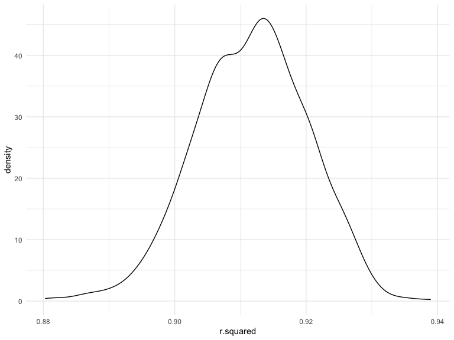

Homework 6 solutions
================
Jeff Goldsmith

### Due date

Due: December 3 at 11:59pm.

### Points

| Problem   | Points |
|:----------|:-------|
| Problem 0 | 20     |
| Problem 1 | –      |
| Problem 2 | 40     |
| Problem 3 | 40     |

### Problem 0

This “problem” focuses on structure of your assignment, including the
use of R Markdown to write reproducible reports, the use of R Projects
to organize your work, the use of relative paths to load data, and the
naming structure for your files.

To that end:

-   create a public GitHub repo + local R Project for this assignment
-   write solutions using a .Rmd file that outputs a `github_document` /
    .md file
-   submit a link to your repo via Courseworks

Your solutions to Problems 1 and 2 should be implemented in your .Rmd
file, and your git commit history should reflect the process you used to
solve these Problems.

For Problem 0, we will assess adherence to the instructions above
regarding repo structure, git commit history, and whether we are able to
knit your .Rmd to ensure that your work is reproducible. Adherence to
appropriate styling and clarity of code will be assessed in Problems 1+
using the homework [style rubric](homework_style_rubric.html).

This homework includes figures; the readability of your embedded plots
(e.g. font sizes, axis labels, titles) will be assessed in Problems 1+.

``` r
library(tidyverse)
library(modelr)
```

### Problem 1

To obtain a distribution for $\hat{r}^2$, we’ll follow basically the
same procedure we used for regression coefficients: draw bootstrap
samples; the a model to each; extract the value I’m concerned with; and
summarize. Here, we’ll use `modelr::bootstrap` to draw the samples and
`broom::glance` to produce `r.squared` values.

``` r
weather_df = 
  rnoaa::meteo_pull_monitors(
    c("USW00094728"),
    var = c("PRCP", "TMIN", "TMAX"), 
    date_min = "2017-01-01",
    date_max = "2017-12-31") %>%
  mutate(
    name = recode(id, USW00094728 = "CentralPark_NY"),
    tmin = tmin / 10,
    tmax = tmax / 10) %>%
  select(name, id, everything())
```

    ## Registered S3 method overwritten by 'hoardr':
    ##   method           from
    ##   print.cache_info httr

    ## using cached file: ~/Library/Caches/R/noaa_ghcnd/USW00094728.dly

    ## date created (size, mb): 2022-04-04 04:13:35 (7.647)

    ## file min/max dates: 1869-01-01 / 2022-04-30

``` r
weather_df %>% 
  modelr::bootstrap(n = 1000) %>% 
  mutate(
    models = map(strap, ~lm(tmax ~ tmin, data = .x) ),
    results = map(models, broom::glance)) %>% 
  select(-strap, -models) %>% 
  unnest(results) %>% 
  ggplot(aes(x = r.squared)) + geom_density()
```



In this example, the $\hat{r}^2$ value is high, and the upper bound at 1
may be a cause for the generally skewed shape of the distribution. If we
wanted to construct a confidence interval for $R^2$, we could take the
2.5% and 97.5% quantiles of the estimates across bootstrap samples.
However, because the shape isn’t symmetric, using the mean +/- 1.96
times the standard error probably wouldn’t work well.

We can produce a distribution for $\log(\beta_0 * \beta1)$ using a
similar approach, with a bit more wrangling before we make our plot.

``` r
weather_df %>% 
  modelr::bootstrap(n = 1000) %>% 
  mutate(
    models = map(strap, ~lm(tmax ~ tmin, data = .x) ),
    results = map(models, broom::tidy)) %>% 
  select(-strap, -models) %>% 
  unnest(results) %>% 
  select(id = `.id`, term, estimate) %>% 
  pivot_wider(
    names_from = term, 
    values_from = estimate) %>% 
  rename(beta0 = `(Intercept)`, beta1 = tmin) %>% 
  mutate(log_b0b1 = log(beta0 * beta1)) %>% 
  ggplot(aes(x = log_b0b1)) + geom_density()
```


As with $r^2$, this distribution is somewhat skewed and has some
outliers.

The point of this is not to say you should always use the bootstrap –
it’s possible to establish “large sample” distributions for strange
parameters / values / summaries in a lot of cases, and those are great
to have. But it is helpful to know that there’s a way to do inference
even in tough cases.
