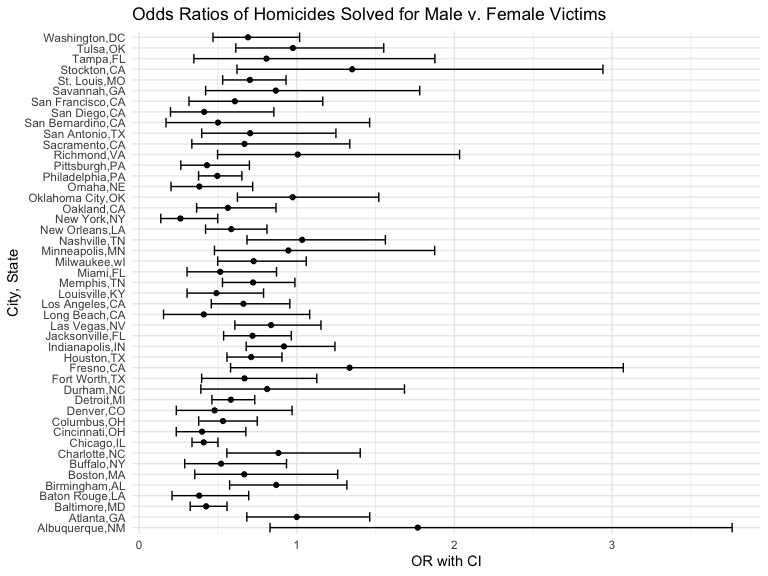

HW6
================
Matt Untalan
2022-12-03

### Due date

Due: December 3 at 11:59pm.

### Points

| Problem   | Points |
|:----------|:-------|
| Problem 0 | 20     |
| Problem 1 | –      |
| Problem 2 | 40     |
| Problem 3 | 40     |

### Problem 2

``` r
homicide = 
  read_csv("data/homicide-data.csv", na = c("", "Unknown")) %>%
  mutate(
    city_state = paste(city, state, sep = ","),
    victim_age = as.numeric(victim_age),
    status = ifelse(disposition == "Closed by arrest", 1, 0), 
  ) %>%
  subset(!(city_state %in% c("Dallas,TX","Phoenix,AZ","Kansas City,MO","Tulsa,AL"))) %>%
  subset(victim_race == "White" | victim_race == "Black")
```

    ## Rows: 52179 Columns: 12
    ## ── Column specification ────────────────────────────────────────────────────────
    ## Delimiter: ","
    ## chr (8): uid, victim_last, victim_first, victim_race, victim_sex, city, stat...
    ## dbl (4): reported_date, victim_age, lat, lon
    ## 
    ## ℹ Use `spec()` to retrieve the full column specification for this data.
    ## ℹ Specify the column types or set `show_col_types = FALSE` to quiet this message.

``` r
glm_balt = 
  homicide %>%
  subset(city_state == "Baltimore,MD") %>%
  glm(status ~ victim_age + victim_sex + victim_race, data = ., family = binomial)

broom::tidy(glm_balt) %>% 
  mutate(
    OR = exp(estimate), 
    low_CI = exp(estimate - 1.96*std.error), 
    up_CI = exp(estimate + 1.96*std.error)
  ) %>%
  filter(term == "victim_sexMale") %>% 
  select(OR, low_CI, up_CI) %>% 
  knitr::kable(digits = 3)
```

|    OR | low_CI | up_CI |
|------:|-------:|------:|
| 0.426 |  0.325 | 0.558 |

The odds of a homicide being solved for a male victim is 0.426 times the
odds of a homicide being solved for a female victim. We are 95%
confident that the true odds ratio falls between 0.325 and 0.558.

``` r
glm_all = 
  homicide %>%
  group_by(city_state) %>%
  nest() %>%
  mutate(
    logit_solve = map(data, ~glm(status ~ victim_age + victim_sex + victim_race, family = binomial, data=.x)),
    logit_solve = map(logit_solve, broom::tidy)
  ) %>%
  select(-data) %>%
  unnest() %>%
  filter(term == "victim_sexMale") %>% 
  mutate(
    OR = exp(estimate), 
    low_CI = exp(estimate - 1.96*std.error), 
    up_CI = exp(estimate + 1.96*std.error), 
    city_state = fct_reorder(city_state, estimate)) %>% 
  select(city_state, OR, low_CI, up_CI)  
```

``` r
glm_all %>%
  ggplot(aes(x = city_state, y = OR)) + 
  geom_point() + 
  geom_errorbar(aes(ymin = low_CI, ymax = up_CI)) +
  coord_flip() +
  labs(title = "Odds Ratios of Homicides Solved for Male v. Female Victims",
       x = "City, State",
       y = "OR with CI")
```



Taking confidence interval into account, most cities solve appreciably
less homicides with male victims than female victims. In fact, no city
shows an odds ratio of greater than 1 with a confidence interval that
does not include 1.
